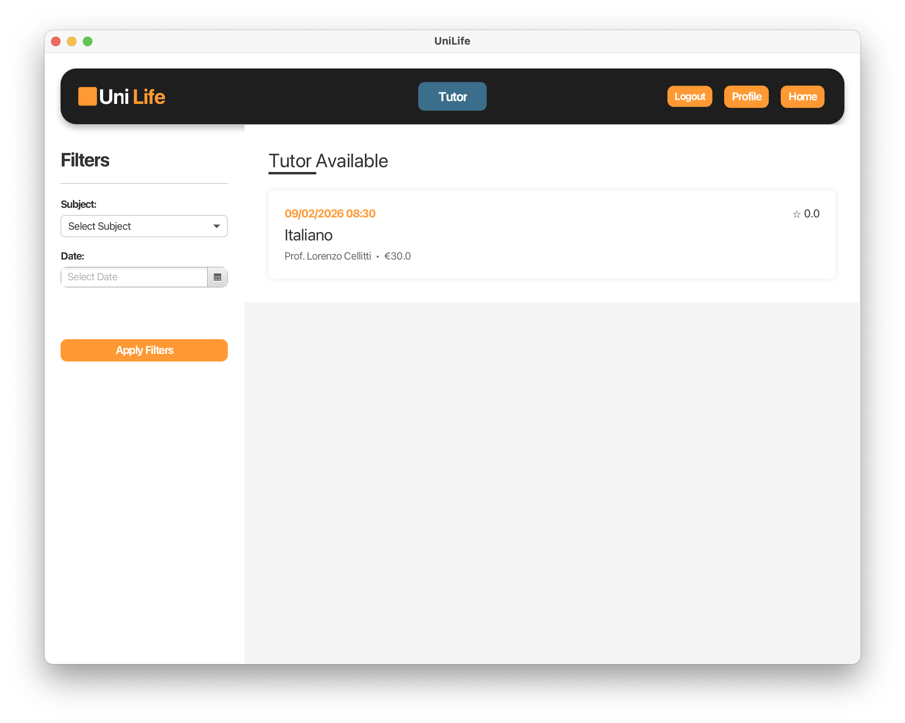

# UniLife

**Academic Tutoring & University Discovery Platform**

UniLife is a desktop application that connects students, tutors, and university staff on a single platform. It helps students find the right course, book tutoring sessions, and manage their applications — while giving tutors and universities the tools they need on their end.

Built for the Software Engineering and Web Design course (A.Y. 2025–2026).



---

## Overview

The system supports three user roles — Student, Tutor, and University Employee — each with dedicated functionalities:

- **Course Discovery** — Browse and filter the course catalogue by language, duration, ranking, and more. View detailed information including admission requirements and living costs.
- **Tutoring** — Tutors publish available sessions; students find the ones that work for their schedule and book them. Both sides get notified.
- **Application Management** — Students submit applications with the required documents. University employees evaluate them, and the system sends the outcome back to the student.
- **Payments** — Integrated payment flow with Stripe for tutor lesson bookings, including validation and error handling.
- **Session Tracking** — Concurrent user sessions handled via token-based mechanisms.

---

## Architecture

Java-based application following the **Model-View-Controller (MVC)** pattern.

| Pattern | Where it's used |
|---------|----------------|
| Singleton | `Configuration`, `SessionManager` |
| Abstract Factory | `DAOFactory` (JSON, DB, Demo) |
| Observer | Reactive notification logic via `NotificationService` |
| Facade | Simplified interface over the notification subsystem |
| Adapter | External auth services (GitHub, Google OAuth) |

---

## Requirements

**Software** — JDK 21+, Maven 3.8+, JavaFX SDK 21, MySQL 8.0+ or MariaDB 10.6+, Git. Cross-platform (Windows 10/11, macOS 12+, Ubuntu 20.04+).

**Hardware** — Multi-core CPU (i5 / Ryzen 5 or equivalent), 8 GB RAM minimum (16 GB for dev), 500 MB free disk, 1366×768 display minimum, internet connection.

---

## Getting Started

### 1. Clone the repository

```bash
git clone https://github.com/Marcoos4/ISPW-UNILIFE-PROJECT.git
cd ISPW-UNILIFE-PROJECT
```

### 2. Set up the database

Make sure MySQL or MariaDB is running, then import the schema:

```bash
mysql -u root -p < database/unilife_db.sql
```

This will create the `unilife_db` database with all tables, indexes, foreign keys, and sample data. The sample data includes three demo users:

| Username | Role | Password |
|----------|------|----------|
| `marco` | Student | `a` |
| `lore` | Tutor | `a` |
| `ale` | University Employee | `a` |

If your MySQL instance uses a different host or port, update the database connection settings in the project configuration before launching.

### 3. Build and run

```bash
mvn clean install
mvn javafx:run
```

---

## Testing

Tests are split into Controller-layer suites (course discovery logic) and Model/Bean-layer suites (requirement validation):

- Admission requirements retrieval and error handling for missing courses
- Course detail consistency between backend and returned objects
- Dynamic search filter generation with logical range categorization
- Partial string matching for course name search
- Filter-based course narrowing
- Document validation (presence, size, format)
- Text input validation (character limits)

---

## Code Quality

Monitored via [SonarCloud](https://sonarcloud.io/project/overview?id=Marcoos4_ISPW-UNILIFE-PROJECT) — Project: `Marcoos4_ISPW-UNILIFE-PROJECT`.

---

## Documentation

Full project documentation (SRS, Use Cases, UML diagrams, Storyboards) available [here](docs/ISPW_UniLife.pdf).

---

## Authors

Lorenzo Cellitti · Marco Zirilli

---
---

# UniLife

**Piattaforma di Tutoraggio Accademico e Scoperta Universitaria**

UniLife è un'applicazione desktop che mette in contatto studenti, tutor e personale universitario su un'unica piattaforma. Aiuta gli studenti a trovare il corso giusto, prenotare lezioni di tutoring e gestire le proprie candidature — offrendo allo stesso tempo a tutor e università gli strumenti di cui hanno bisogno.

Sviluppata per il corso di Ingegneria del Software e Progettazione Web (A.A. 2025–2026).


---

## Panoramica

Il sistema prevede tre ruoli utente — Studente, Tutor e Impiegato Universitario — ciascuno con funzionalità dedicate:

- **Ricerca Corsi** — Esplora e filtra il catalogo corsi per lingua, durata, ranking e altro. Visualizza informazioni dettagliate su requisiti di ammissione e costi della vita.
- **Tutoraggio** — I tutor pubblicano le sessioni disponibili; gli studenti trovano quelle compatibili con i propri impegni e le prenotano. Entrambe le parti vengono notificate.
- **Gestione Candidature** — Gli studenti inviano la candidatura con i documenti richiesti. Gli impiegati universitari la valutano e il sistema comunica l'esito allo studente.
- **Pagamenti** — Flusso di pagamento integrato con Stripe per la prenotazione delle lezioni, con validazione e gestione errori.
- **Tracciamento Sessioni** — Gestione delle sessioni utente concorrenti tramite meccanismi token-based.

---

## Architettura

Applicazione Java basata sul pattern **Model-View-Controller (MVC)**.

| Pattern | Dove è applicato |
|---------|-----------------|
| Singleton | `Configuration`, `SessionManager` |
| Abstract Factory | `DAOFactory` (JSON, DB, Demo) |
| Observer | Logica reattiva delle notifiche via `NotificationService` |
| Facade | Interfaccia semplificata sul sottosistema di notifica |
| Adapter | Servizi di autenticazione esterni (GitHub, Google OAuth) |

---

## Requisiti

**Software** — JDK 21+, Maven 3.8+, JavaFX SDK 21, MySQL 8.0+ o MariaDB 10.6+, Git. Cross-platform (Windows 10/11, macOS 12+, Ubuntu 20.04+).

**Hardware** — CPU multi-core (i5 / Ryzen 5 o equivalente), 8 GB RAM minimo (16 GB per sviluppo), 500 MB disco libero, display minimo 1366×768, connessione internet.

---

## Installazione

### 1. Clona il repository

```bash
git clone https://github.com/Marcoos4/ISPW-UNILIFE-PROJECT.git
cd ISPW-UNILIFE-PROJECT
```

### 2. Configura il database

Assicurati che MySQL o MariaDB sia in esecuzione, poi importa lo schema:

```bash
mysql -u root -p < database/unilife_db.sql
```

Questo creerà il database `unilife_db` con tutte le tabelle, indici, foreign key e dati di esempio. I dati di esempio includono tre utenti demo:

| Username | Ruolo | Password |
|----------|-------|----------|
| `marco` | Studente | `a` |
| `lore` | Tutor | `a` |
| `ale` | Impiegato Universitario | `a` |

Se la tua istanza MySQL usa un host o una porta diversi, aggiorna le impostazioni di connessione al database nella configurazione del progetto prima dell'avvio.

### 3. Compila e avvia

```bash
mvn clean install
mvn javafx:run
```

---

## Testing

I test sono organizzati in suite per il layer Controller (logica di scoperta corsi) e per il layer Model/Bean (validazione requisiti):

- Recupero requisiti di ammissione e gestione errori per corsi inesistenti
- Consistenza dei dati tra backend e oggetti restituiti
- Generazione dinamica dei filtri di ricerca con categorizzazione in range logici
- Matching parziale per la ricerca corsi per nome
- Filtraggio corsi in base ai parametri selezionati
- Validazione documenti (presenza, dimensione, formato)
- Validazione input testuali (limiti di caratteri)

---

## Qualità del Codice

Monitorata tramite [SonarCloud](https://sonarcloud.io/project/overview?id=Marcoos4_ISPW-UNILIFE-PROJECT) — Progetto: `Marcoos4_ISPW-UNILIFE-PROJECT`.

---

## Documentazione

La documentazione completa del progetto (SRS, Use Case, diagrammi UML, Storyboard) è disponibile [qui](docs/ISPW_UniLife.pdf).

---

## Autori

Lorenzo Cellitti · Marco Zirilli